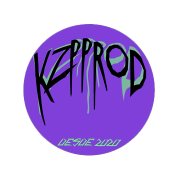

<h1 align="center"> Projeto Um </h1>

Este projeto foi desenvolvido com base nas aulas do Curso "Discovery" do site RocketSeat.  
<a href="https://app.rocketseat.com.br/journey/discover/overview">Saiba mais sobre o curso original clicando aqui.</a>

  

 

  
  

  
  

## 🚀 Tecnologias

Esse projeto foi desenvolvido com as seguintes tecnologias:

- HTML e CSS
- JavaScript
- Git e Github
- Figma

## 💻 Projeto

O DevLinks é um agregador de links para usar como cartão de visitas online. No caso desse projeto, um local onde os trabalhos mais recentes da produtora estão reunidos.

- [Acesse o projeto finalizado, online](https://jonaskzp.github.io/projetoum)

- [Assistir aulas RocketSeat](https://app.rocketseat.com.br/journey/discover/overview)

## 🔖 Layout

Você pode visualizar o layout do projeto através [DESSE LINK](https://www.figma.com/community/file/1187422022288947321). É necessário ter conta no [Figma](https://figma.com) para acessá-lo.

## &#129309; Licença

Esse projeto está sob a licença MIT.

---

Feito com ♥ by Rocketseat. [Participe da nossa comunidade!](https://discord.gg/rocketseat)
